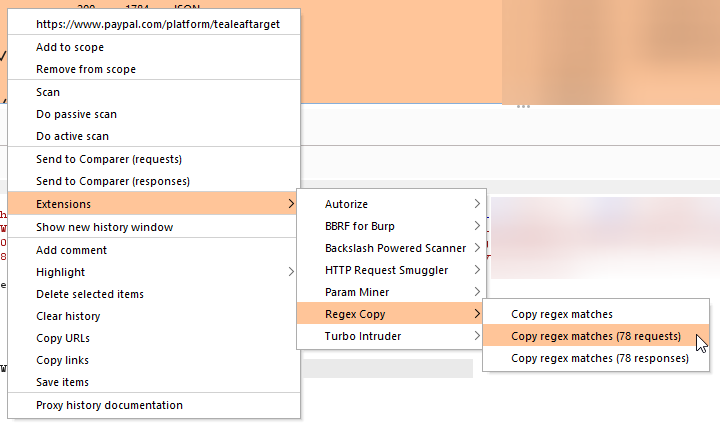

# Copy Regex Matches

Copy Regex Matches is a Burp Suite plugin to copy regex matches from selected requests and/or responses to the clipboard.

## Install

Download the [jar](./build/libs/copy-regex-matches-all.jar) from this repository and install in Burp Extender.

## How to use

Select the requests you want to search through, right-click and go to Extensions > Regex Copy to choose whether to search through requests, responses, or both.

